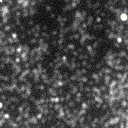
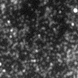
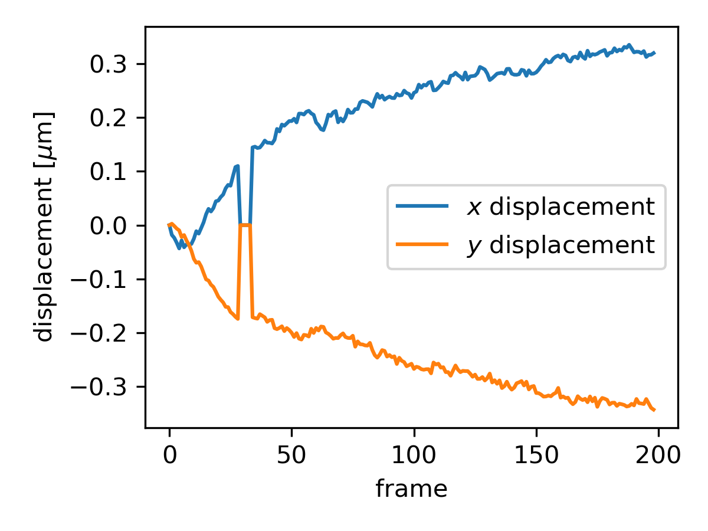
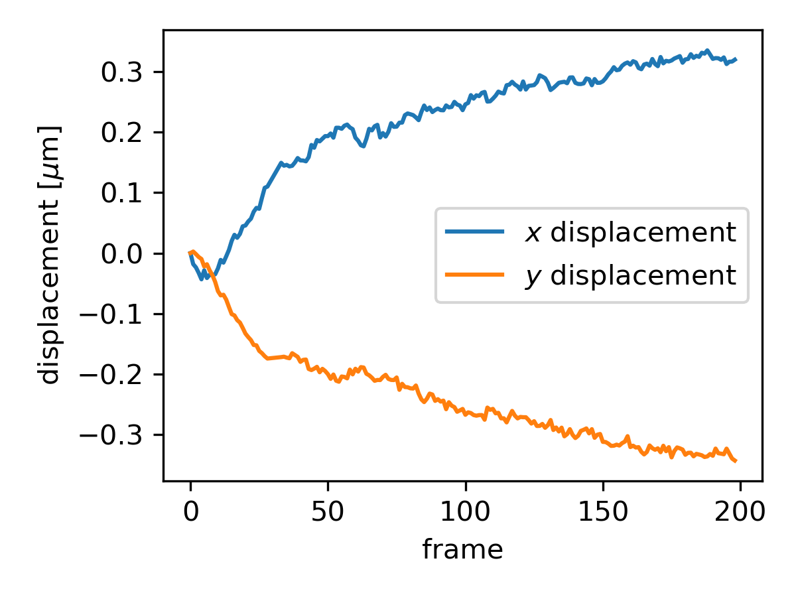

     


# Sub-pixel image registration using single particle tracking

Registration  of  microscopy  images  is  often  crucial to measure biophysical quantities such as forces and displacements, that can be barely perceptible. Saccades and drifts are unavoidable when acquiring an image sequence on most microscopes.  To correct for the drift, feature based approaches, such as SIFT, usually perform well under most conditions but computation time can become a problem for long movies.  We propose an approach that mimics the behavior of the eye when looking at a movie in need of  alignment. At  high  frame  rates,  the  eye  can  easily pinpoint objects being translated at a low pace, with a high degree of correlation.  We will call these objects the reference  objects,  which  can  be  defects  on  a  substrate or  fluorescent  molecules  that  are  assumed  to  be  static with respect to the substrate.  The displacement field of those objects can be extracted from their tracks, easily acquired with the tracker TrackMate.  The corrective image shift is then applied in Fourier space to the original frames.

<div align="center">
  
Original TFM stack             |  Drift corrected stack
:-------------------------:|:-------------------------:
  |  
  
</div>

## Dependencies

To clone the repository, go to the folder of your choice and run in a terminal:

```bash
git clone https://github.com/remyeltorro/subpixel_registration_spt registration
```

In order to install the required python packages:

```bash
pip install -r requirements.txt
```

## Acquisition of tracks 

The reference tracks are acquired using TrackMate, but any `.csv` table containing  position and a track ID should work. TrackMate’s LoG detector applies a Laplacian of Gaussian filter, giving a strong response for gaussian-like spots of radius , which must be tuned to the average size of the beads.  For each object, the detector applies a Gaussian fit, which allows for the determination of a subpixel centroid. Once the objects of interest are detected, TrackMate’s LAP particle linking algorithm, which combines a nearest  neighbour  penalty  function  with  similitude  criteria (intensity, shape, size...), is used to connect the detections throughout the frames. The maximum linking distance is increased until most of the long tracks are no longer truncated. If the focus is lost on some frames, we can introduce enough tracking gaps to "jump" over the blurry frames. In the end, most of the tracks should be as long as the movie itself. A filter on the track length can be used at the last step to get rid of most of the spurious tracks. A `.csv` file containing the required information can be exported as `trajectories.csv` and put in 📁`data/`. 

⚠ On the latest TrackMate version, two additional line of alternate column labels are added at the beginning of the `.csv` table, please erase them before proceeding with the alignment.

## Alignment

⚠ Make sure that 📁`data/images/` is empty before proceeding

The sequence of frames to be aligned must be saved in 📁`data/images/` ( `File > Save As > Image Sequence...`) in TIFF format. Then move in the 📁`scripts/` and run:

```bash
python align.py
```

Set the pixel calibration and the script will perform the registration in two passes, based on the `trajectories.csv` table stored in 📁`data/`. All frames are aligned with respect to the first frame of the movie. On the first pass, it will ignore the frames for which we don't have any reference track, on the second it will interpolate the displacement of those skipped frames.

## Results

<div align="center">
  
Displacement field before interpolation             |  Interpolated displacement
:-------------------------:|:-------------------------:
  |  
  
</div>
